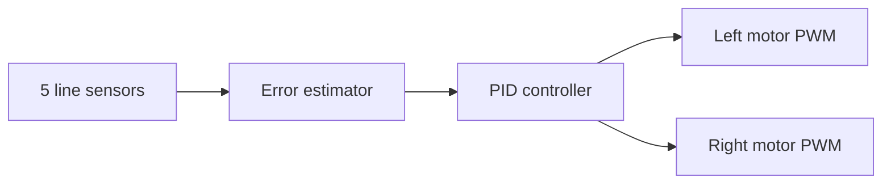

# Five-Sensor Line-Following Robot

Arduino C++ firmware for a differential-drive line-following robot developed for the ENSI RoboCup 2024 environment.

## Control system

- Five analog reflectance sensors
- White/black surface calibration
- Discrete line-position error calculation
- PID-based left/right motor correction
- PWM motor control through an H-bridge
- Button-controlled calibration and run states

## Hardware assumptions

- Arduino-compatible microcontroller
- Five analog line sensors on `A0`–`A4`
- Dual motor driver
- Two DC motors
- Calibration/start button

Pin assignments and initial gains are defined at the top of `versionpid5capteurs.cpp`.

## Use

Open the source in an Arduino-compatible build environment, confirm the board and pin mapping, then compile and upload. Calibrate the sensors on both background and line surfaces before enabling motion.

## Safety and tuning

Start with the robot lifted, verify motor direction, cap PWM during early tuning, and keep a physical power cutoff nearby. Tune proportional response first, then derivative damping, and add integral correction only when necessary.

## Status

Competition prototype preserved as a single firmware source file.
